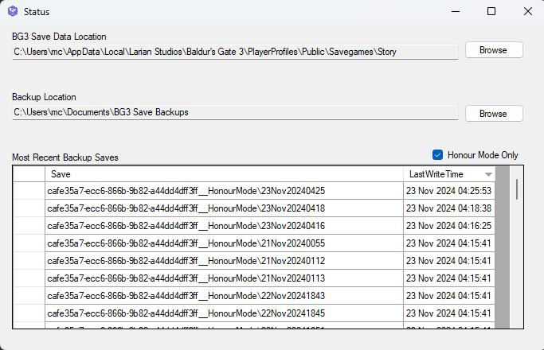

# BG3 Save Backup

The BG3 Save Data Location field will default to the standard location. The Backup Location field will default to a new folder in your My Documents folder.

The application can be minimized to the tray.

Standard saves are copied as is (if enabled).

Honour Mode saves are copied to a timestamped subdirectory so there is a snapshot of each save state.
