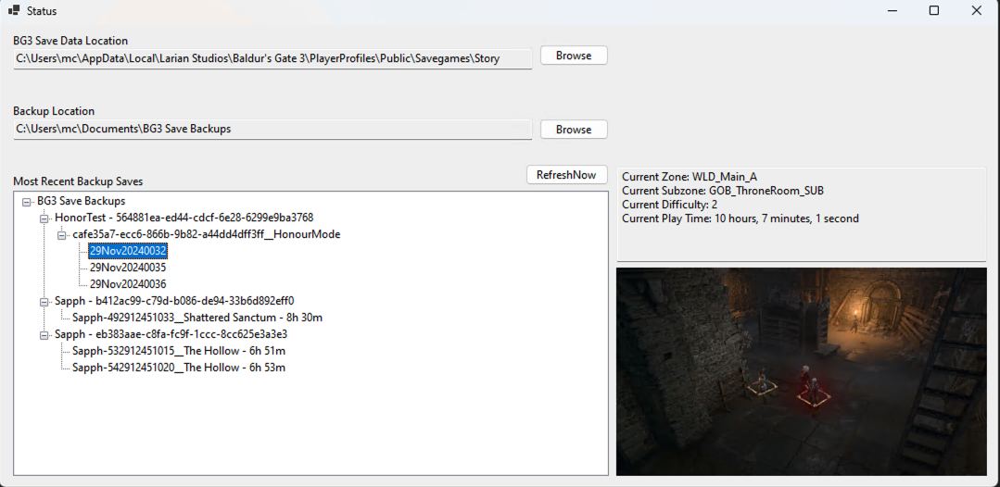

# BG3 Save Backup

The BG3 Save Data Location field will default to the standard location. The Backup Location field will default to a new folder in your My Documents folder.

The application can be minimized to the tray.

Standard saves are copied as is (if enabled).

Honour Mode saves are copied to a timestamped subdirectory so there is a snapshot of each save state.

##LEGAL

libwebp.dll, as part of the Google WebM project, is released under the same license as the WebM project. See https://www.webmproject.org/license/software/ or the "[COPYING](COPYING)" file for details. An additional intellectual property rights grant can be found in the file [PATENTS](PATENTS).

All other code is (C) Nicholas Gibson, 2024.
